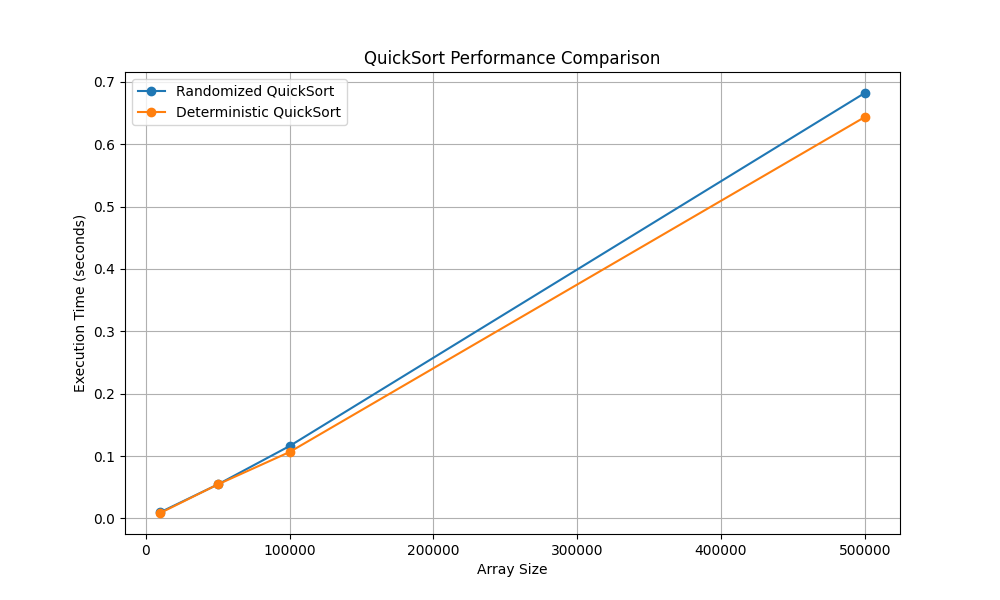

# QuickSort Performance Analysis

This report compares the execution time of **Randomized QuickSort** and **Deterministic QuickSort** on arrays of different sizes.

## Results

```
Розмір масиву  RandQuickSort (сек)      DetQuickSort (сек)
------------------------------------------------------------
10000          0.009964                 0.008777
50000          0.054485                 0.054536
100000         0.116169                 0.106580
500000         0.682078                 0.643472
```
## Performance Chart



## Conclusion

In this experiment, the **deterministic QuickSort** (with the pivot selected as the middle element) demonstrated **better performance** on large arrays. This is likely due to the nature of the input data — despite being randomly generated, the arrays turned out to be relatively well-balanced, which favored efficient partitioning with a fixed pivot.
The advantage of the **randomized approach** typically emerges on poorly ordered or adversarial datasets, where a fixed pivot selection may lead to worst-case performance scenarios.
